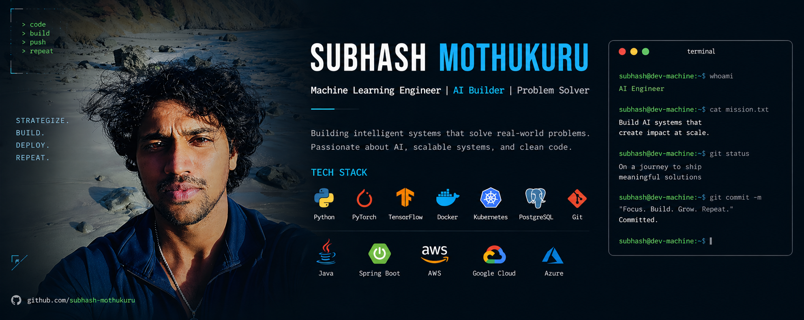

  

<h1 align="center">Hi 👋 I'm Subhash Mothukuru</h1>

  

## 🚀 About Me

- 🧠 Machine Learning Engineer building End to End Product
- 🤖 Building AI systems and scalable ML pipelines
- ☁️ Interested in Cloud AI infrastructure
- 🔬 Exploring LLMs, RAG systems, and multimodal AI

## ⚡ Tech Stack

## ⚙️ Tech Stack

### Languages

### Machine Learning

### Backend & APIs

### Infrastructure & DevOps

### Cloud Platforms

## 🧠 Focus Areas

- Machine Learning Systems
- LLM & Retrieval Augmented Generation (RAG)
- Scalable Backend Architectures
- Cloud Native AI Infrastructure
- Distributed Model Training
